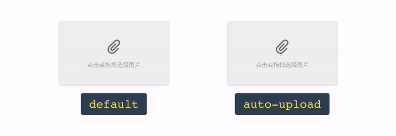

<br>

<p align="center">
  
</p>
<br>

<p align="center">
  
  
  
</p>

<br>

<p align="center">
  <b>
    <a href="https://segmentfault.com/a/1190000008503338">教程: 从0开始做一个文件选择(上传)组件</a>
    |
    <a href="http://waynecz.github.io/VueImgInputer/index.html">查看 Demo</a>
  </b>
</p>

<br>

## 简介

- 就像 `<input type="file" />`，不支持多图片选择
- 支持自动上传功能
- 拖拽选择、预览、也可以当 `` 使用
- 两套主题，其他高度定制

<br>

## 截图

<p align="center">
  
</p>

<br>

## 使用

```bash
npm install vue-img-inputer
```

```javascript
import ImgInputer from 'vue-img-inputer'
import 'vue-img-inputer/dist/index.css'

Vue.component('ImgInputer', ImgInputer)
```

```html

```

<br>

## 接口

<details open><summary><strong><code>自动上传</code> 相关</strong></summary>
<br>

1.  **`auto-upload`**: Boolean  
    设置开启自动上传功能

2.  **`action`**: String  
    上传的 URL

3.  **`upload-key`**: String  
    **default**: `file`  
    图片在 form-data 中的 key 名

4.  **`extra-data`**: Object  
    上传的额外数据

5.  **`headers`**: Object  
    上传的额外 headers

6.  **`with-cookie`**: Boolean  
    是否携带 cookie

7.  **`on-start`**: Function  
    **params**: func ( file )  
    上传开始的钩子函数

8.  **`on-progress`**: Function  
    **params**: func ( event, file )  
    上传中的钩子函数，可以通过 `event.percent` 获得当前上传进度

9.  **`on-success`**: Function  
    **params**: func ( res, file )  
    上传成功的钩子函数，`res` 是服务端返回的数据

10. **`on-error`**: Function  
    **params**: func ( err, file )  
    上传失败的钩子函数

<br/>
</details>

<details><summary><strong><code>Input 标签</code> 相关</strong></summary>
<br>

1.  **`accept`**: String  
    **default**: `image/*,video/*;`  
    建议设置成像 `image/jpg,image/gif;` 之类的具体指，不然可能造成文件夹呼出特别慢

2.  **`placeholder`**: String  
    **default**: `点击或拖拽选择图片`

3.  **`id`**: String  
    **default**: random string in 4 length

4.  **`readonly`**: Boolean

5.  **`capture`**: Boolean  
    **default**: `false`  
    在移动端是否直接呼出相机

6.  **`max-size`**: Number  
    **default**: 5120  
    图片大小限制 (KB)

7.  **`name`**: Boolean  
    原生 name 属性

8.  **`任意 input 的原生属性`**: any  
    任意 input 的原生属性都将继承给内部的 input 标签

<br/>
</details>

<details><summary><strong><code>视觉 </code> 相关</strong></summary>
<br>

1.  **`img-src`**: String  
    图片回填地址，设置后组件将会像 `` 标签一样

2.  **`theme`**: String  
    **default**: `material`
    两套主题 (light / material)

3.  **`size`**: String
    small / normal / large

4.  **`icon`**: String  
    clip / img / img2

5.  **`ali-icon`**: String  
    如果你用了 [iconfont.cn](http://iconfont.cn/), 可以设置你项目里的 icon unicode 值

6.  **`no-mask`**: Boolean  
    去除 hover 蒙版

7.  **`no-hover-effect`**: Boolean  
    去除所有 hover 效果

8.  **`bottom-text`**: String  
    **default**: `点击或拖拽图片以修改`  
    hover 后底部的文字

9.  **`readonly-tip-text`**: String  
    **default**: `不可更改`  
    只读情况下底部的文字

<br/>
</details>

<details><summary><strong><code>事件</code></strong></summary>
<br>

1.  **`on-change`**: Function  
    **params**: func ( file, fileName )  
    文件更改时的钩子函数

2.  **`onExceed`**: Function  
    **params**: func ( file )  
    文件超出最大设置时的钩子函数

<br/>
</details>

<details><summary><strong><code>组件方法</code></strong></summary>
<br>

1.  **`reset`**  
    重置组建的数据，但不重置 `img-src`

<br/>
</details>
